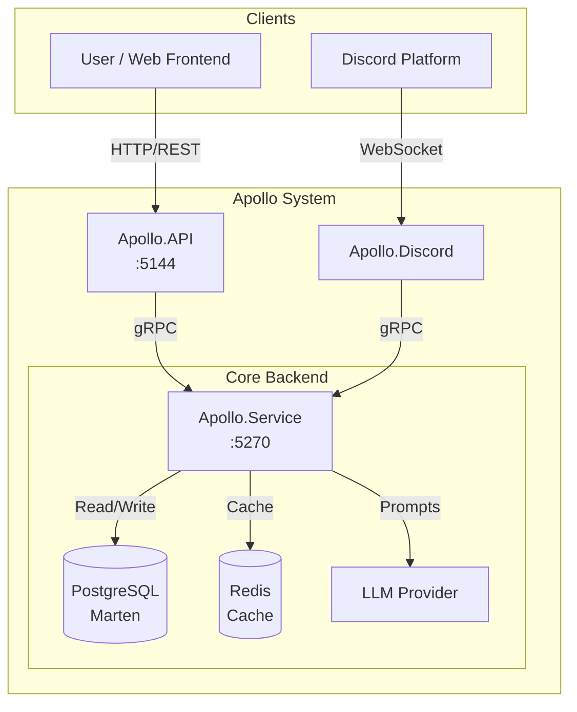
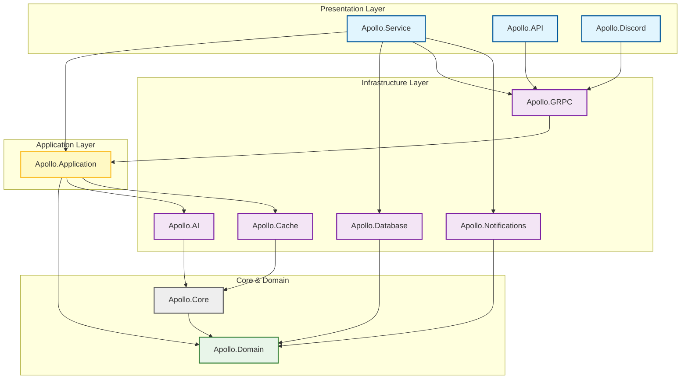
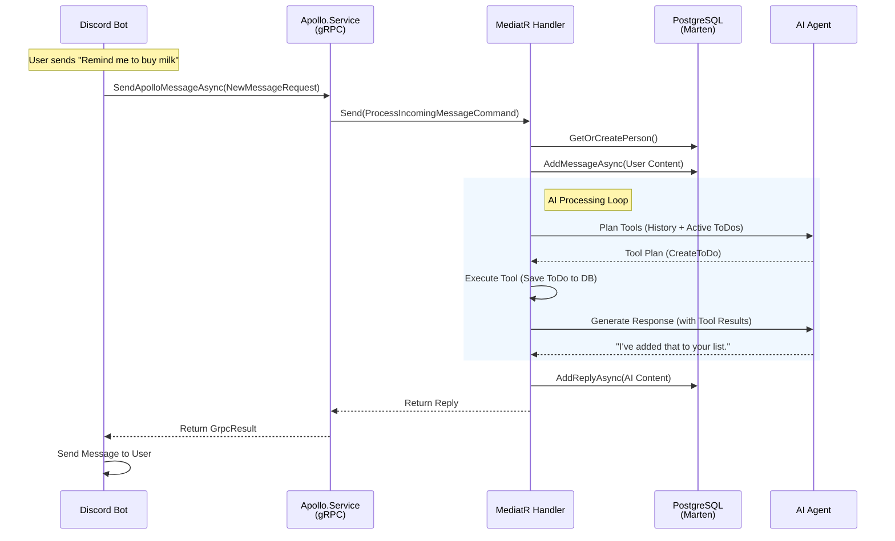
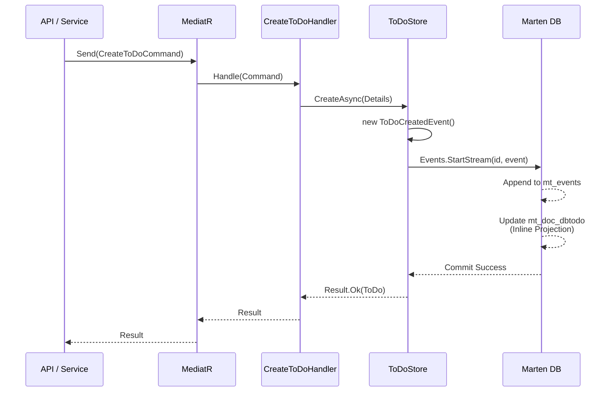
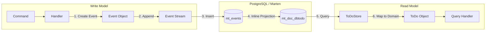

# Apollo's Architecture Overview

Apollo is a personal assistant for neurodivergent users, built as a modular microservice with a focus on scalability and maintainability. The system leverages modern .NET patterns and practices:

- **gRPC**: Inter-service communication between API, Discord bot, and backend service
- **CQRS**: Command Query Responsibility Segregation using MediatR and FluentResults
- **Event Sourcing**: Marten with PostgreSQL as the source of truth
- **Semantic Kernel**: Microsoft's SDK for AI orchestration and LLM integration
- **Dependency Injection**: Modular, testable architecture throughout

---

## System Architecture

Apollo uses a **hub-and-spoke architecture** where `Apollo.Service` acts as the central backend. Interface layers (`API`, `Discord`) communicate with it via gRPC.



### Service Ports (Development)

| Service | Port | Protocol | Description |
|---------|------|----------|-------------|
| Apollo.Service | 5270 | gRPC | Central backend host |
| Apollo.API | 5144 | HTTP | REST gateway + Swagger UI |
| Apollo.Discord | - | WebSocket | Discord bot (worker service) |
| PostgreSQL | 5432 | TCP | Database |
| Redis | 6379 | TCP | Distributed cache |

---

## Project Structure

The solution follows Clean Architecture principles with pragmatic coupling where beneficial.



### Layer Organization

| Layer | Projects | Description |
|-------|----------|-------------|
| **Presentation** | `Apollo.Service`, `Apollo.API`, `Apollo.Discord` | Entry points and host applications |
| **Transport** | `Apollo.GRPC` | Shared gRPC contracts, clients, and interceptors |
| **Application** | `Apollo.Application` | Use cases, MediatR handlers, orchestration |
| **Infrastructure** | `Apollo.Database`, `Apollo.AI`, `Apollo.Cache`, `Apollo.Notifications` | External concerns: persistence, LLMs, caching, notifications |
| **Shared** | `Apollo.Core` | Common DTOs, logging utilities, extensions |
| **Domain** | `Apollo.Domain` | Pure business entities and value objects |

---

## Request Flow

This sequence shows how a Discord message flows through the system:



---

## CQRS Pattern

Apollo uses MediatR for command/query separation with a unified Store pattern wrapping Marten.



### Command vs Query Flow

- **Commands** change state: `CreateToDoCommand` → Handler → Store → Event → Marten
- **Queries** read state: `GetToDoByIdQuery` → Handler → Store → Marten Document Query

---

## Event Sourcing

Apollo uses Marten as both event store and document database. Events are the source of truth, with inline projections for read models.



### Key Concepts

- **Events**: Immutable records in `Apollo.Database/*/Events/` (e.g., `ToDoCreatedEvent`)
- **Aggregates**: `Db*` classes with `Apply()` methods (e.g., `DbToDo`, `DbConversation`)
- **Projections**: `SnapshotLifecycle.Inline` - read models update synchronously
- **Storage**: Events in `mt_events`, projections in `mt_doc_*` tables

---

## Projects

### Apollo.Domain

Core domain entities, value objects, and domain services. Pure business logic with no external dependencies. Organized around `Conversations`, `People`, and `ToDos` aggregates.

---

### Apollo.Core

Shared utilities, abstractions, and contracts used across all projects. Includes logging utilities, result extensions, time provider helpers, and common DTOs.

**Key Packages:** `FluentResults`

---

### Apollo.Application

Application layer with use-cases and business orchestration. Implements CQRS pattern using MediatR. Contains plugins for AI tool execution (`ToDoPlugin`, `RemindersPlugin`, `PersonPlugin`).

**Key Packages:** `MediatR`

---

### Apollo.Database

Data persistence using Marten for event sourcing and Entity Framework Core for migrations. Contains stores, events, and aggregate projections.

**Key Packages:** `Marten`, `Microsoft.EntityFrameworkCore`, `Npgsql`

---

### Apollo.AI

AI agent implementations powered by Microsoft Semantic Kernel. Provides `IApolloAIAgent` interface for chat completions, tool planning, and LLM interactions.

**Key Packages:** `Microsoft.SemanticKernel`

---

### Apollo.Cache

Redis-based distributed caching infrastructure.

**Key Packages:** `StackExchange.Redis`

---

### Apollo.GRPC

Shared gRPC communication infrastructure. Contains code-first contracts, client stubs, server services, and interceptors.

**Key Packages:** `protobuf-net.Grpc`, `Grpc.Net.Client`

---

### Apollo.Notifications

Outbound notification system with channel abstractions. Includes `DiscordNotificationChannel` for Discord DMs.

**Key Packages:** `NetCord`

---

### Apollo.Service

Main backend host application. Runs the gRPC server, Quartz scheduler (e.g., `ToDoReminderJob`), and orchestrates all backend components.

**Key Packages:** `Quartz`, `Grpc.AspNetCore`, `NetCord`

---

### Apollo.API

HTTP/REST gateway with OpenAPI documentation. Serves the Vue SPA and forwards requests to Apollo.Service via gRPC.

**Key Packages:** `Microsoft.AspNetCore.OpenApi`

---

### Apollo.Discord

Discord bot host using NetCord. Handles slash commands, interactions, and bot functionality.

**Key Packages:** `NetCord.Hosting`

---

### Client

Vue 3 single-page application built with Vite and TypeScript.

**Key Packages:** `vue`, `vite`, `typescript`

---

## Coding Practices

### General

- Use DTOs for inter-service communication
- Follow `.editorconfig`: 2-space indentation, UTF-8, max 120 character lines
- Prefer file-scoped namespaces (`namespace X;`)
- Sort `using` directives with `System` first

### Naming Conventions

| Type | Convention | Example |
|------|------------|---------|
| Classes/Records | PascalCase | `ToDoStore`, `PersonNotificationClient` |
| Interfaces | `I` prefix | `IToDoStore`, `IApolloAIAgent` |
| Value Objects | Concept name | `ToDoId`, `Description`, `Priority` |
| DTOs | `DTO` suffix | `ToDoDTO`, `ChatCompletionRequestDTO` |
| Commands | `Command` suffix | `CreateToDoCommand` |
| Queries | `Query` suffix | `GetToDoByIdQuery` |
| Handlers | `Handler` suffix | `CreateToDoCommandHandler` |
| Events | `Event` suffix | `ToDoCreatedEvent` |

### Type Design

- Use `sealed` on classes/records not intended for inheritance
- Use `readonly record struct` for single-value wrappers (e.g., `ToDoId`)
- Use `record` for domain models with multiple properties
- Use primary constructors for dependency injection
- Mark nullable types explicitly with `?`

### Error Handling

- Use FluentResults `Result<T>` instead of exceptions for expected failures
- Return `Result.Ok(value)` for success, `Result.Fail(message)` for failures
- Use `result.IsFailed` and `result.IsSuccess` for control flow
- Always check `.IsFailed` before accessing `.Value`

### Async Patterns

- Accept optional `CancellationToken` with default value
- Suffix async methods with `Async`
- Return `Task<Result<T>>` for operations that can fail

### Logging

- Use source-generated logging with `[LoggerMessage]` attribute
- Group related logs in static partial classes (e.g., `ToDoLogs`)
- Include Event IDs for filtering

### Dependency Injection

- Register services in `ServiceCollectionExtension` classes
- Use `TryAdd*` for overridable defaults
- Prefer `AddScoped` for request-scoped, `AddSingleton` for config

### Testing

- Framework: xUnit with Moq
- Name pattern: `MethodName` + `Scenario` + `ExpectedResult`
- Use `MockSequence` for ordered verifications
- Organize with Arrange/Act/Assert

### gRPC Contracts

- Use `[DataContract]` and `[DataMember]` with explicit `Order`
- Use `required` properties with `init` setters

### Event Sourcing

- Events are immutable records
- Streams keyed by aggregate ID
- Use `StartStream` for new, `Append` for existing
- Configure inline snapshot projections

---

## Local Development

### Prerequisites

- [.NET 10 SDK](https://dotnet.microsoft.com/download)
- [Docker Desktop](https://www.docker.com/products/docker-desktop)

### Start Backing Services

```bash
docker-compose up -d pgsql redis
```

Verify: PostgreSQL on `localhost:5432`, Redis on `localhost:6379`

### Configuration

Copy `.env.example` to `.env` for Docker, or use User Secrets for local development:

```bash
# Apollo.Service
cd src/Apollo.Service
dotnet user-secrets set "ApolloAIConfig:ApiKey" "YOUR_API_KEY"

# Apollo.Discord
cd src/Apollo.Discord
dotnet user-secrets set "Discord:Token" "YOUR_DISCORD_BOT_TOKEN"
dotnet user-secrets set "Discord:PublicKey" "YOUR_DISCORD_PUBLIC_KEY"
```

### Running Services

Run each in a separate terminal:

```bash
# Terminal 1: Backend Service (gRPC + Scheduler)
dotnet watch --project src/Apollo.Service/Apollo.Service.csproj

# Terminal 2: HTTP API Gateway
dotnet watch --project src/Apollo.API/Apollo.API.csproj

# Terminal 3: Discord Bot
dotnet watch --project src/Apollo.Discord/Apollo.Discord.csproj
```

- **Swagger UI:** http://localhost:5144/swagger
- **gRPC:** localhost:5270

### Troubleshooting

- **Database errors:** Ensure Docker containers are running (`docker ps`)
- **gRPC errors:** Verify Apollo.Service is running on port 5270
- **Redis errors:** Check Redis connection string in appsettings
